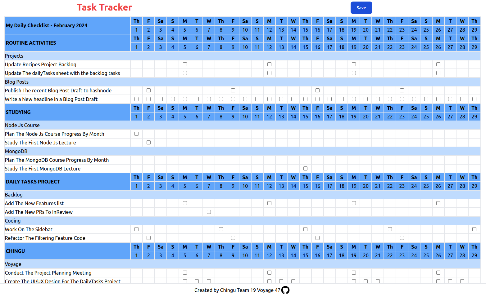

# Task Tracker

## Overview

---

A daily task productivity tool is a system designed to help individuals organize and manage their tasks effectively on a day-to-day basis.

It typically includes features such as task creation, scheduling, prioritization, and tracking. Users can input tasks, assign deadlines, set priorities, categorize tasks based on projects or urgency, and monitor progress.

These tools often come with user-friendly interfaces, allowing users to easily navigate, add, edit, and delete tasks. They may include features like reminders, notifications, and integrations with calendars or emails to keep users informed about upcoming tasks or deadlines.

Overall, a daily task productivity tool aims to streamline task management, enhance organization, and improve efficiency in completing daily tasks and achieving goals.

## Description:

---

The Task Tracker lets the user keep track of the task, their status, and additional descriptions.
The user can save the changes to their device when they update it.

## Features:

---

- Interactive UI
- React TypeScript Tailwind Stack
- Loads initial data from JSON
- Implements data persistance through Local Storage

---
## Check out the Fireball App!
[Click Here](https://daily-tasks-seven.vercel.app/) to visit the live project and try the Task Tracker App for yourself!

---
# Acknowledgments

## Authors

- [Jonatan](https://github.com/jcidp)
- [Beth](https://github.com/bscaer)

---

## Dependencies

- React
- TypeScript
- Tailwind
- Vite

---

# Functionality

- Initial Checklist Generation:
  - Utilize the provided JSON data to generate the initial matrix that lists categories and tasks on the left side and days of the month along the top (triggered by user).
  - Display checkboxes at the intersections of categories/tasks and days.
  - Generate the matrix only for the current month.
  - Determine the current month dynamically based on the system's date.
- Categories & Tasks
  - Display all available categories and their associated tasks on the left side of the matrix.
  - Populate the matrix with tasks listed under their respective categories.
- Days of the Month
  - Populate the top row of the matrix with the days of the current month.
  - Ensure correct alignment of dates based on the current month's calendar.
- Checkbox Intersections
  - Display checkboxes at the intersections of each task/category and the corresponding day of the month.
  - Populate checkboxes only for the specific date(s) tasks are to be completed, as mentioned in the JSON data.
  - Reflect completion status by dynamically checking/unchecking these checkboxes based on the completion status data.
- Additional Notes:
  - Upon completing a task (checking the corresponding checkbox), enable a feature to input additional notes related to that specific task.
  - Direct users to a dedicated page or modal window where they can type, edit, and save notes related to the completed task.
  - Implement a user-friendly text input field or area, enabling users to add comprehensive details or comments.
  - Include a "Save" or "Submit" button to store these notes and associate them with the completed task for future reference or review.
- Local Storage Implementation
  - Implement local storage functionality post-initial checklist generation.
  - Store the generated checklist in the local storage to persist user data beyond the initial session.
  - Update the checklist in the local storage whenever changes are made.
  - Introduce a "Save" button specifically for updating local storage.
  - On clicking "Save," capture the current state of the task list, including modifications and progress.
  - Store this updated data in the local storage to maintain the latest user changes.
- Dynamic Data Handling
  - Fetch and display only relevant tasks and days for the current month.
  - Handle cases where tasks may have different due dates within the month.
  - If the user clicks on a task that has been completed, remove the check mark. In other words, clicking toggles the checkmark
  - Click on task name to show additional detailed description in a popup
